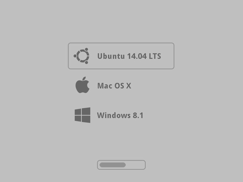

Triple EFI boot on Mac OS X / Parallels
=======================================

This is my EFI boot configuration using *Grub* 2.00 for booting *Ubuntu*,
*Windows 8.1* and *Mac OS X*.

[  ](screenshots/full.png)

This configuration lets me boot *Windows* and *Ubuntu* from external USB3 drive
from *Mac* boot menu.

**NOTE:** *Windows* has to be installed via *Parallels* since only Enterprise
version allows direct installation on selected USB drives.

Installing via *Parallels* workarounds that. Booting *Windows* can be done from
any drive however.

### Theme

Configuration uses *Mac* *Grub* 2.00 theme made by myself, that works best on
*FullHD* or *Retina* displays.

### Installation

Just checkout this repository into some *HFS+* or *FAT32* partition on *GPT*
partitioned drive into `/efi/` root directory, *i.e.*:

	cd /Volumes/Boot
	git clone https://github.com/nanoant/efi.git

Use *Parallels* with "EFI Boot" option enabled or reboot your *Mac* keeping
Option pressed.

### Configuration

Adjust `boot/grub.cfg` to match your settings.

### Setting icons and labels for EFI boot partitions

1. Setting boot icon is as simple as putting `.VolumeIcon.icns` file onto
   partition containing `/efi/` folder.

2. Setting boot label can be done with

   ```
   bless --folder /Volumes/Boot --label NameOfOS
   ```

### Booting just once from some EFI boot partition

	bless --folder /Volumes/Boot --nextonly

### Booting Windows 8.1 via EFI on Mac

#### Creating Windows EFI boot partition

1. Create ~`100 MB` FAT32 boot partition, set its GUID to `efi`

2. Copy whole `/efi/` folder from *Windows* USB flash drive installation made
   by *Bootcamp* to that partition.
   
3. Boot into USB flash drive installer and press *Shift+F10* for command prompt.

4. Mount your EFI boot partition with `diskpart`

   ```
   DISKPART> list vol
   DISKPART> sel vol EFI_INDEX
   DISKPART> assign letter=b
   ```

4. Regenerate BCD store with:

   ```
   cd /d b:\EFI\Microsoft\Boot\
   bcdboot c:\Windows /l en-gb /s b: /f ALL
   ```

Now you should be able to boot directly to *Windows* from Mac EFI menu.

### License

This software is provided under *MIT* license:

> Copyright (c) 2012 Adam Strzelecki
>
> Permission is hereby granted, free of charge, to any person obtaining a copy
> of this software and associated documentation files (the "Software"), to deal
> in the Software without restriction, including without limitation the rights
> to use, copy, modify, merge, publish, distribute, sublicense, and/or sell
> copies of the Software, and to permit persons to whom the Software is
> furnished to do so, subject to the following conditions:
>
> The above copyright notice and this permission notice shall be included in
> all copies or substantial portions of the Software.
>
> THE SOFTWARE IS PROVIDED "AS IS", WITHOUT WARRANTY OF ANY KIND, EXPRESS OR
> IMPLIED, INCLUDING BUT NOT LIMITED TO THE WARRANTIES OF MERCHANTABILITY,
> FITNESS FOR A PARTICULAR PURPOSE AND NONINFRINGEMENT. IN NO EVENT SHALL THE
> AUTHORS OR COPYRIGHT HOLDERS BE LIABLE FOR ANY CLAIM, DAMAGES OR OTHER
> LIABILITY, WHETHER IN AN ACTION OF CONTRACT, TORT OR OTHERWISE, ARISING FROM,
> OUT OF OR IN CONNECTION WITH THE SOFTWARE OR THE USE OR OTHER DEALINGS IN THE
> SOFTWARE.
